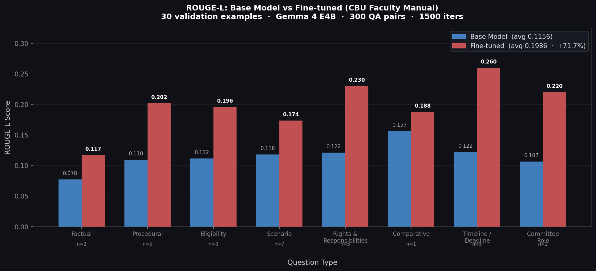

# CBU Faculty Manual — Fine-Tuned LLM

Fine-tune a local language model on the California Baptist University Employee Manual
(Faculty Section) to serve as an on-device policy assistant for faculty affairs questions.

Two notebooks are provided — pick the one that matches your hardware:

| Notebook | Hardware | Model | Framework | Launch |
|----------|----------|-------|-----------|--------|
| `CBU_Faculty_Finetune_MLX.ipynb` | Mac Apple Silicon (M1–M4) | Gemma 4 E4B | MLX + LoRA | |
| `CBU_Faculty_Finetune_Colab.ipynb` | Google Colab (free T4 GPU) | Gemma 2-2B | Unsloth + QLoRA | [](https://colab.research.google.com/github/Mrhaneul/cbu_faculty_handbook/blob/main/CBU_Faculty_Finetune_Colab.ipynb) |

---

## Pipeline

```
PDF → Chunks → Enrich → QA Pairs → Format → Train → Evaluate → Export GGUF
  1       2        3         4         5        6         7           8
```

| Stage | Script | Output |
|-------|--------|--------|
| 1 — Chunk | `scripts/chunker.py` | `data/chunks.jsonl` |
| 2 — Enrich | `scripts/enricher.py` | `data/enriched.jsonl` |
| 3 — Generate | `scripts/generator.py` | `data/seeds.jsonl` |
| 4 — Format | `scripts/formatter.py` | `data/train.jsonl` + `data/valid.jsonl` |
| 5 — Train | `scripts/trainer.py` | `outputs/cbu-gemma4-e4b-mlx-v1/` |
| 6 — Evaluate | `scripts/evaluator.py` | `eval/results.jsonl` |
| 7 — Plot | `scripts/plot_eval.py` | `eval/rouge_chart.png` |
| 8 — Export | `scripts/burn_gguf.py` | `burns/model.Q4_K_M.gguf` |

---

## Quick Start (MLX — Apple Silicon)

**Prerequisites:** Mac with M-series chip, [Ollama](https://ollama.com) running with `gemma4:latest` pulled.

```bash
# 1. Create conda environment
conda create -n caimll_finetuning python=3.11 -y
conda activate caimll_finetuning

# 2. Install dependencies
pip install -r requirements.txt
pip install mlx-lm

# 3. Place your PDF in the project root
cp /path/to/cbu_faculty.pdf .

# 4. Run the full pipeline
python scripts/run_pipeline.py

# 5. Deploy with Ollama
cd burns/cbu-gemma4-e4b-mlx-v1
ollama create cbu-faculty-gemma4 -f Modelfile
ollama run cbu-faculty-gemma4
```

**Run individual stages:**
```bash
python scripts/run_pipeline.py --stages 1,2     # chunk + enrich only
python scripts/run_pipeline.py --stages 3 --target 300  # generate QA pairs
python scripts/run_pipeline.py --stages 5 --iters 1500  # train only
python scripts/run_pipeline.py --resume         # skip completed stages
```

---

## Quick Start (Colab — T4 GPU)

1. Open `CBU_Faculty_Finetune_Colab.ipynb` in Google Colab
2. Enable GPU: Runtime → Change runtime type → T4 GPU
3. Accept the [Gemma 2 license](https://huggingface.co/google/gemma-2-2b-it) on HuggingFace
4. Run cells top to bottom — upload `cbu_faculty.pdf` when prompted

---

## Evaluation Results (MLX run)

| Metric | Score |
|--------|-------|
| Base model ROUGE-L | 0.1153 |
| Fine-tuned ROUGE-L | 0.2044 |
| Improvement | **+77.4%** |
| Examples improved | **28 / 30** |



---

## Project Structure

```
├── scripts/
│   ├── chunker.py       # Stage 1: PDF → policy chunks
│   ├── enricher.py      # Stage 2: metadata tagging
│   ├── generator.py     # Stage 3: QA pair generation (Ollama)
│   ├── formatter.py     # Stage 4: chat template formatting
│   ├── trainer.py       # Stage 5: MLX LoRA training
│   ├── evaluator.py     # Stage 6: ROUGE-L evaluation
│   ├── plot_eval.py     # Stage 7: evaluation chart
│   ├── burn_gguf.py     # Stage 8: GGUF export for Ollama
│   └── run_pipeline.py  # Pipeline orchestrator
├── data/                # Generated (not committed)
├── eval/
│   └── rouge_chart.png  # Evaluation results chart
├── CBU_Faculty_Finetune_MLX.ipynb    # Apple Silicon notebook
├── CBU_Faculty_Finetune_Colab.ipynb  # Google Colab notebook
├── requirements.txt
└── RUNBOOK.md           # Detailed operational notes
```

---

## Key Design Choices

- **LLM-generated QA pairs** — Ollama (Gemma 4) generates questions with reasoning traces, not rule-based keyword matching
- **Reasoning traces** — Every MLX training example includes a `<|channel>thought` trace showing how to derive the answer from the policy text
- **Citation enforcement** — All answers end with `[Reference: CBU Faculty Manual, Policy X.XXX]`
- **8 question types** — factual, procedural, eligibility, scenario, rights & responsibilities, comparative, timeline/deadline, committee role
- **No cloud required** — MLX pipeline runs entirely on-device on Apple Silicon

---

## Requirements

```
requests>=2.31.0
pypdf>=6.0.0
rouge-score>=0.1.2
matplotlib
numpy
```

MLX-specific (not in requirements.txt — install separately):
```bash
pip install mlx-lm
```

Colab-specific:
```bash
pip install unsloth pdfplumber datasets trl
```
